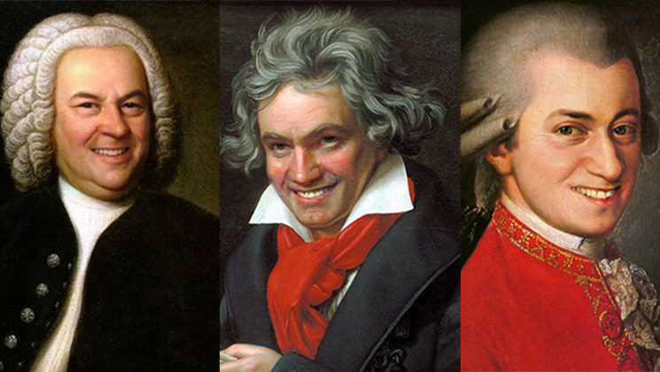
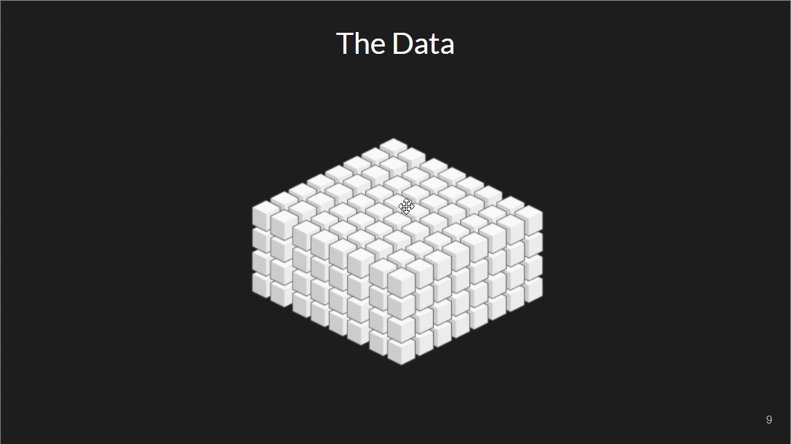
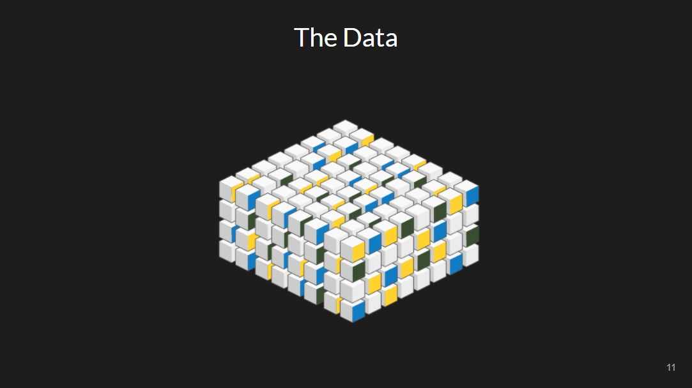
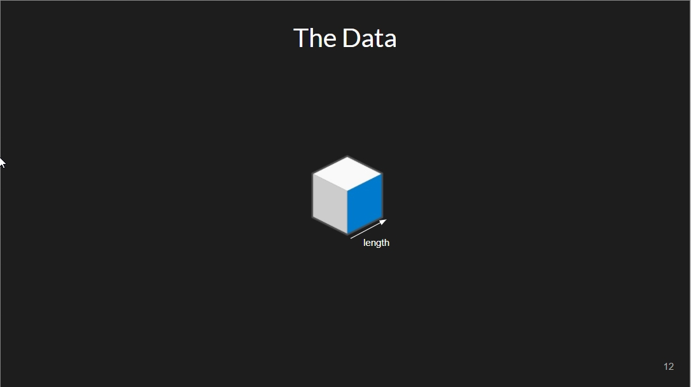
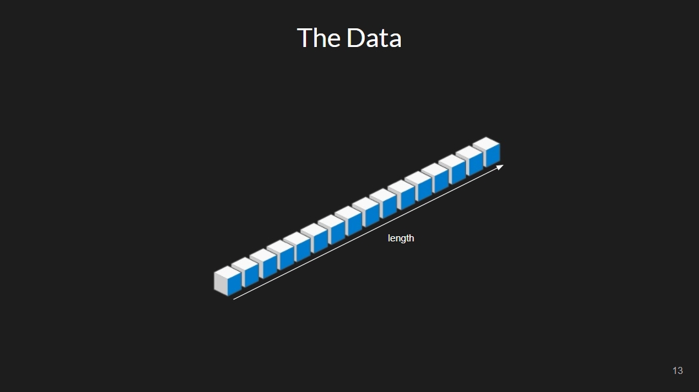
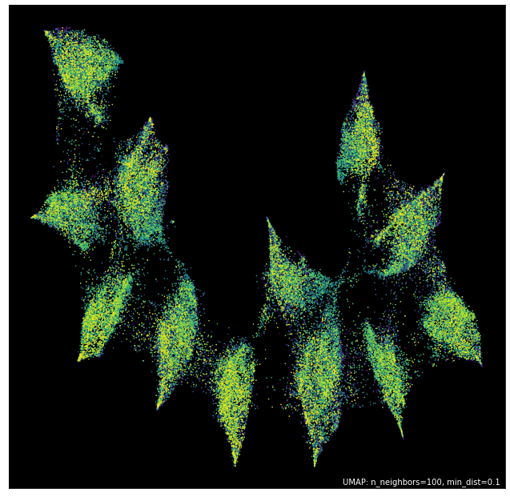
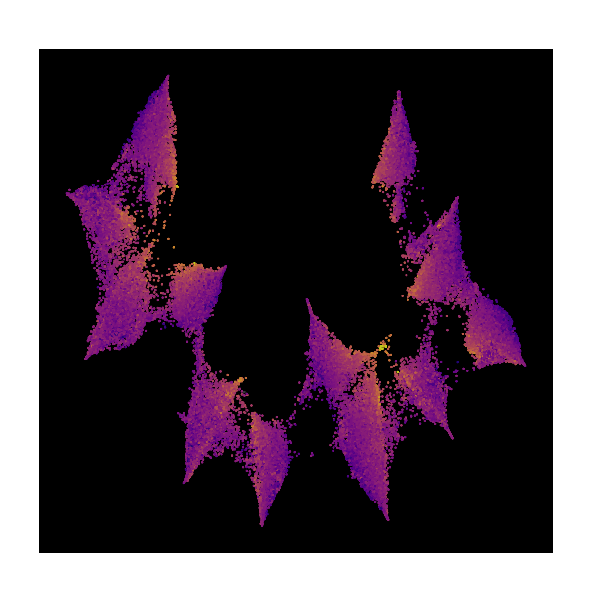
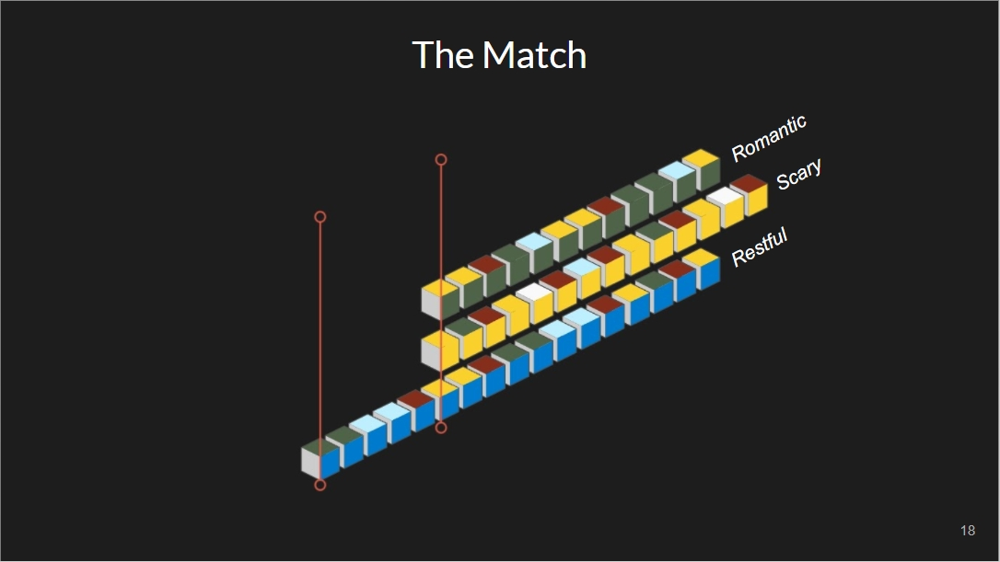

# Data analysis

From a music dataset I've gathered and processed, I have analyzed the data for use in a 
live mixing application that makes connections based on musical similarity. This is then
used to generate a live soundtrack in real-time.

# The data

I started from a collection of classical music of around 800 pieces of classical music that
were untagged and unprocessed, the first step was to process everything to the stame frame 
rate, bandwidth and filetypes.

The next step was to use State Of The Art pre-trained models to extract relevant musical 
information ranging from mood keywords to instrumentation. This was a first step in making 
sense of the data but wasn't enough.

# Splitting

Each piece of music has a certain length, and in the full length there are several smaller 
units of music we call bars and beats. Using the MadMom library these were splitted to 
the smallest musical unit.

This was no trivial task, as the dataset went from 800 pieces to 110k snippets of music.
All these are then analyzed based on Valence, Arousal and harmonic context. Using Librosa's
DSP functionalities as well as pytorch pre-trained models.

# Mapping the data

The similarities between the features of each snippets are mapped onto a 2d projection using the
UMAP algorithm for manifold learning. the projection looks like this.

## Root Notes

It get's interesting when we plot musical attributes over the projection. When we take a look at the 
key the music is in it looks like this. This represent the 12 semitones in an octave, much like the 
keys on a piano.

## Tempo Changes

Plotting tempo shows a gradient from slow to fast within each cluster.

## Chord Voicings

Similarly we can see the direction of chord voicings move over the different clusters.

# Combining

In the final dataset, all extracted information is structured so as to make it possible to 
combine the 2 forms of analysis. This allows us to perform matching on any point in the music
to another piece, allowing real-time matching.

